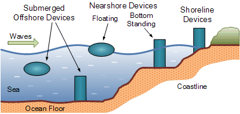

# 🌊 Energy Generation from Ocean Waves

> A Research paper by **Aniket Singh**  
> Exploring the potential of wave energy as a clean, renewable power source  
> 📍 Submitted as part of academic research at **KET’s V. G. Vaze College** 
> 📅Date of Submission: 29th March 2023

---

## 📘 Abstract

With the rising global energy demands and the urgency to reduce greenhouse gas emissions, ocean wave energy presents a promising renewable alternative. Ocean waves possess one of the highest energy densities among all renewable sources. This project explores the **feasibility, technology, benefits, and challenges** of converting wave motion into clean electricity.

- 🌐 Global wave energy potential: 2 Terawatts (TW) annually
- 🇮🇳 India’s coastline: ~7500 km with ~14 kW/m average wave power potential
- 🔋 A 10% utilization could generate over 7500 MW of clean energy

---

[🖺 Read the Reseach Paper](Energy-Generation-From-Ocean-Waves.pdf)
-
---

## 🌎 Why Ocean Waves?

- Renewable & Abundant  
- High Energy Density  
- Predictable and Consistent  
- 24/7 Power Generation  
- Minimal Land Footprint  
- Huge Potential in Coastal Nations  

---

## 🔧 Types of Wave Energy Converters (WECs)

### 📍 Based on Location
- **Shoreline Devices** – OWC, LIMPET
- **Near-Shore Devices** – Wave Star, Osprey
- **Offshore Devices** – Pelamis, Archimedes Wave Swing, Wave Dragon

### ⚙️ Based on Operating Condition
- Floating Devices – PowerBuoy  
- Partially Submerged – Oscillating Surge Converter  
- Fully Submerged – Archimedes Wave Swing  
<!--

-->

---

## ⚡ How It Works

Waves transfer mechanical motion to a **converter mechanism** like:
- **Buoys** or **Panels** that move with wave motion  
- Transducers (Hydraulic, Mechanical, Electromagnetic)  
- **Linear Permanent Magnet Generators** or **Turbines**  
- Stored or transmitted to grid via subsea cables  

---

## 📈 Benefits

- ✅ Clean & Carbon-Free  
- ✅ Renewable & Reliable  
- ✅ High Energy Output  
- ✅ Minimal Visual/Noise Impact  
- ✅ Long Operational Lifespan (~25 years)  
- ✅ Economic Boost for Coastal Areas  

---

## ⚠️ Challenges

- 💰 High Capital Cost  
- 🌊 Harsh Marine Conditions  
- 🐠 Environmental Impact on Marine Life  
- 🛠️ Infrastructure & Grid Integration  
- 🔋 Need for Efficient Energy Storage  

---

## 📍 Wave Energy in India

- **Western Coastline** shows greater wave power potential (~15–19 kW/m)  
- **Pondicherry Coast**: Cost-effective zone with 31.8 kW/m observed  
- ~85% of wave energy potential is during the monsoon season (June–Sept)  

---

## 🔬 Technologies Covered

| WEC Type | Example Devices |
|----------|-----------------|
| Oscillating Water Column | LIMPET, OWC Port Kembla |
| Wave Profile | PowerBuoy |
| Overtopping | Wave Dragon |
| Floating Absorbers | Wave Star, Waveline Magnet |
| Hydraulic Systems | Eco Wave Power, Gibraltar |
| Submerged Converters | Archimedes Wave Swing |
| Tapered Channels | TAPCHAN, Norway |
| Surge-Driven | WaveRoller, Portugal |

---

## 🚀 Future Scope

Wave energy is still in its developmental stage, but:
- **R&D is increasing globally**
- **Storage systems like batteries, capacitors, SMES** are improving
- Multipurpose WECs (e.g., **CETO**, Australia) can provide **desalination + electricity**
- Expected to play a major role in **India’s renewable roadmap**

---

## 🧠 Conclusion

Wave energy is a high-potential, clean, and sustainable alternative to fossil fuels. While challenges exist in deployment and scalability, continuous innovation and global collaboration can make ocean waves a major contributor to the world’s future energy supply.

---

## 📚 References

- [Wikipedia - Wave Power](https://en.m.wikipedia.org/wiki/Wave_power)
- [Eco Wave Power](https://www.ecowavepower.com/)
- [WaveRoller - AW Energy](https://aw-energy.com/waveroller/)
- [SWEL – Waveline Magnet](https://swel.eu/research/)
- [ScienceDirect – Ocean Energy](https://www.sciencedirect.com/science/article/pii/S2666285X22000632)
- [World Economic Forum - Ocean Energy](https://www.weforum.org/agenda/2022/03/wave-energy-ocean-electricity-renewables/)

---

> 💡 *“The ocean is a vast energy reservoir — it's time we surfed the waves for power.”* 
> -*Aniket Singh*
